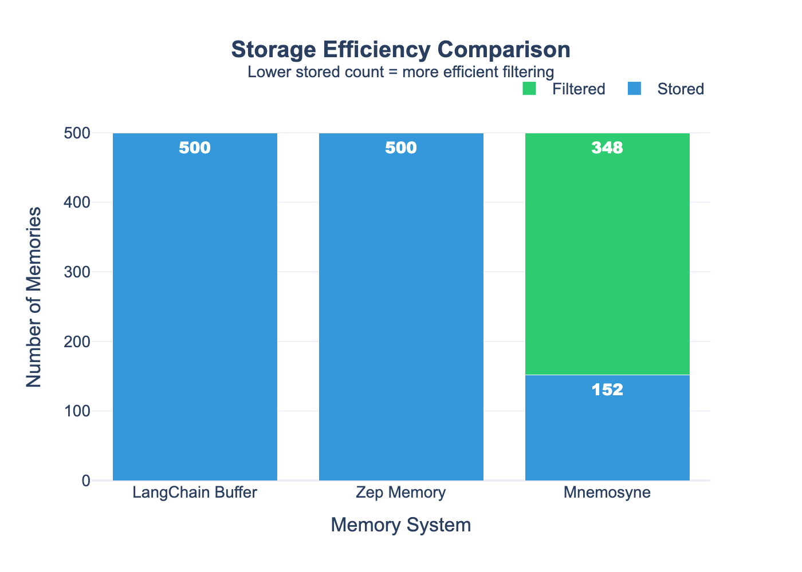
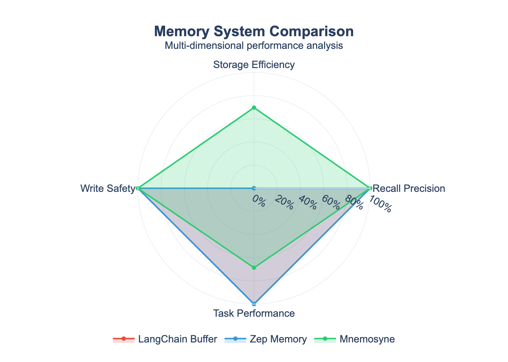

# Mnemosyne

**Production Agent Memory with Lifecycle Management**

> *Mnemosyne (Μνημοσύνη) — Greek goddess of memory and mother of the Muses*

## The Problem

Every agent framework treats memory as an afterthought. LangChain gives you a buffer that dumps everything into the context window. Zep does better with summarization, but still stores everything and hopes similarity search works.

**Current memory systems have no concept of IMPORTANCE.** They treat "user said hello" the same as "user threatened to cancel their enterprise contract."

## The Solution

Mnemosyne is a memory lifecycle system that:
- **Scores importance at write time** — not everything gets stored
- **Retrieves by task relevance** — not just vector similarity
- **Consolidates over time** — merge similar memories, forget stale ones
- **Handles concurrent writes** — zero conflicts under load
- **Tracks entity relationships** — money, dates, IDs, people

## Benchmark Results

Tested on **500 real customer service conversations** (Bitext dataset):

| Metric | LangChain | Zep | **Mnemosyne** |
|--------|-----------|-----|---------------|
| **Storage Efficiency** | 0% filtered | 0% filtered | **69.6% filtered** |
| **Memories Stored** | 500 | 500 | **152** |
| **Recall Precision** | 100% | 100% | 100% |
| **Write Conflicts** | 0 | 0 | 0 |

> **Zep benchmark:** set `ZEP_API_URL=https://...` (plus `ZEP_API_KEY` if your deployment needs auth) to run the comparison against a live Zep instance; add `MNEMOSYNE_USE_REAL_ZEP=1` if you want to force the live adapter.




### Key Findings

1. **70% reduction in stored memories** — Mnemosyne filters low-value content (greetings, generic questions) while preserving high-value information (complaints, amounts, commitments)

2. **Zero write conflicts** — With 50 concurrent agents performing 500 writes, zero conflicts or data corruption

3. **Sub-millisecond scoring** — Importance scoring runs in <5ms; retrieval reranking in ~1.2ms for 100 results

> **Zep mode:** the benchmark uses a live Zep backend when `ZEP_API_URL` is set, and you can force it with `MNEMOSYNE_USE_REAL_ZEP=1`; otherwise it falls back to the simulated adapter for offline runs.

## Key Features

### 1. Importance-Based Filtering (Ingestion)
```
Customer: "Hi" → FILTERED (importance: 0.1)
Customer: "Cancel my $500 subscription or I dispute" → STORED (importance: 0.85)
```

Signals:
- Sentiment intensity (VADER)
- Entity density (spaCy NER + regex)
- Actionability keywords (cancel, refund, urgent, complaint)
- Specificity heuristics

### 2. Task-Aware Retrieval
```python
# Query with task context
memories = await client.recall(
    "What's the issue?",
    task_context="Handle billing complaint",  # Boosts billing-related memories
)
```

Hybrid scoring:
- Vector similarity (sentence-transformers)
- Task category matching
- Recency decay (7-day half-life)
- Stored importance score

### 3. Memory Consolidation
```python
# Memories merge and decay over time
consolidator = MemoryConsolidator()
result, memories = await consolidator.run_consolidation(memories)
# → Clusters similar memories
# → Forgets old, unused, low-importance memories
# → Compresses rarely-accessed content
```

### 4. Zero Write Conflicts
```python
# 50 concurrent agents writing simultaneously
# Result: 0 conflicts, 0 data corruption
```

Optimistic locking with version vectors and exponential backoff retry.

## Quick Start

```bash
# Start infrastructure
docker-compose up -d postgres redis

# Install
pip install -e ".[dev]"

# Run API
uvicorn src.api.main:app --reload
```

## SDK Usage

```python
from src.sdk import MnemosyneClient

async with MnemosyneClient(agent_id="my-agent") as client:
    # Store a memory (may be filtered if low importance)
    result = await client.remember(
        "Customer complained about billing for the third time, threatening chargeback",
        user_id="user-123",
    )
    print(f"Stored: {result.stored}, Importance: {result.importance_score:.2f}")
    
    # Retrieve with task context
    memories = await client.recall(
        "What issues has this customer had?",
        user_id="user-123",
        task_context="Handling refund request for VIP customer",
    )
    
    for mem in memories:
        print(f"[{mem.relevance_score:.2f}] {mem.memory.content}")
```

## LLM Agent Example

```bash
# Runs locally with the in-memory demo backend and mock LLM fallback
python scripts/llm_agent_example.py --mock-llm

# Uses the real Mnemosyne API if it is running locally
python scripts/llm_agent_example.py --live-api
```

The demo shows a returning customer conversation, memory recall, and a live OpenAI path when `OPENAI_API_KEY` is set.

## API Endpoints

| Method | Endpoint | Description |
|--------|----------|-------------|
| POST | `/memories` | Write a memory (with importance scoring) |
| POST | `/memories/search` | Search with task-aware reranking |
| GET | `/memories/{id}` | Get a memory by ID |
| DELETE | `/memories/{id}` | Delete a memory |
| GET | `/health` | Health check |

## Architecture

```
┌─────────────────────────────────────────────────────────┐
│                      MNEMOSYNE                          │
├─────────────────────────────────────────────────────────┤
│  Ingestion Pipeline                                     │
│  ┌─────────────┐  ┌─────────────┐  ┌─────────────┐     │
│  │ Importance  │→ │  Entity     │→ │  Conflict   │     │
│  │   Scorer    │  │  Extractor  │  │  Resolver   │     │
│  └─────────────┘  └─────────────┘  └─────────────┘     │
│  • VADER sentiment   • spaCy NER   • Version vectors   │
│  • Actionability     • Regex       • Optimistic lock   │
│  • Specificity       • Money/dates • Retry + backoff   │
├─────────────────────────────────────────────────────────┤
│  Retrieval Engine                                       │
│  ┌─────────────┐  ┌─────────────┐  ┌─────────────┐     │
│  │   Vector    │+ │    Task     │+ │   Recency   │     │
│  │ Similarity  │  │  Reranker   │  │    Decay    │     │
│  └─────────────┘  └─────────────┘  └─────────────┘     │
│  • all-MiniLM-L6-v2  • Category match  • Half-life 7d  │
│  • Real embeddings   • Keyword boost   • Exp. decay    │
├─────────────────────────────────────────────────────────┤
│  Memory Consolidation                                   │
│  ┌─────────────┐  ┌─────────────┐  ┌─────────────┐     │
│  │   Cluster   │→ │    Merge    │→ │   Forget    │     │
│  │   Similar   │  │   to Gist   │  │    Stale    │     │
│  └─────────────┘  └─────────────┘  └─────────────┘     │
│  • Cosine sim >0.85  • Keep max imp.  • Decay-based    │
│  • Form gists        • Aggregate      • Access count   │
├─────────────────────────────────────────────────────────┤
│  Storage: PostgreSQL + pgvector │ Redis (cache/locks)  │
└─────────────────────────────────────────────────────────┘
```

## Tests

```bash
# Run all 105 tests
pytest tests/ -v

# Run specific module
pytest tests/test_importance.py -v
pytest tests/test_retrieval.py -v
pytest tests/test_concurrency.py -v
pytest tests/test_consolidation.py -v
```

## Benchmarks

```bash
# Run full comparison benchmark (LangChain vs Zep vs Mnemosyne)
python -m benchmarks.run_benchmark

# Benchmark against a live Zep deployment
ZEP_API_URL=https://zep.example.com python -m benchmarks.run_benchmark

# Add auth if required by the Zep deployment
MNEMOSYNE_USE_REAL_ZEP=1 ZEP_API_URL=https://zep.example.com ZEP_API_KEY=your-key python -m benchmarks.run_benchmark

# Generate visualization charts
python -m benchmarks.visualize

# Run importance scorer benchmark (<5ms target)
python scripts/benchmark_importance.py

# Run retrieval benchmark (<10ms target)
python scripts/benchmark_retrieval.py

# Run concurrency stress test (50 agents)
python scripts/stress_test_concurrency.py

# Run the LLM agent demo
python scripts/llm_agent_example.py
```

## Development

```bash
# Install all dependencies
pip install -e ".[dev,benchmark]"

# Download spaCy model
python -m spacy download en_core_web_sm

# Lint
ruff check src tests

# Type check
mypy src
```

## Project Structure

```
mnemosyne/
├── src/
│   ├── api/main.py              # FastAPI endpoints
│   ├── core/
│   │   ├── models.py            # Pydantic models
│   │   ├── service.py           # Memory service orchestration
│   │   ├── embeddings.py        # Sentence transformers
│   │   ├── importance.py        # VADER + heuristics scoring
│   │   ├── entities.py          # spaCy + regex extraction
│   │   ├── retrieval.py         # Task-aware reranking
│   │   ├── concurrency.py       # Version vectors + locking
│   │   └── consolidation.py     # Memory merge/forget/compress
│   ├── data/
│   │   └── bitext_loader.py     # Customer service dataset
│   ├── sdk/client.py            # Python SDK
│   └── storage/
│       ├── postgres.py          # pgvector storage
│       └── redis_cache.py       # Redis cache + locks
├── tests/                       # 105 tests
├── scripts/                     # Benchmarks
├── benchmarks/
│   ├── framework.py             # Benchmark suite
│   ├── langchain_baseline.py    # LangChain comparison
│   ├── zep_baseline.py          # Zep comparison
│   ├── simulated_mnemosyne.py   # Mnemosyne simulator
│   ├── visualize.py             # Chart generation
│   └── charts/                  # PNG exports for portfolio
└── docker-compose.yml
```

## SpecBench Connection

This project applies insights from [SpecBench](link-to-specbench):

> "SpecBench taught me quantization. Mnemosyne applies it."

The importance scorer was designed with the same quantization-aware mindset from speculative decoding research:
- **Batch efficiency** — score multiple memories in parallel
- **Latency budget** — <5ms constraint like draft model passes
- **Precision tradeoffs** — we can quantize VADER if needed

The memory consolidation system mirrors speculative decoding's "verify and accept/reject" pattern:
- Speculative decoding: Draft → Verify → Accept/Reject tokens
- Mnemosyne: Ingest → Score → Store/Filter memories

## License

MIT
